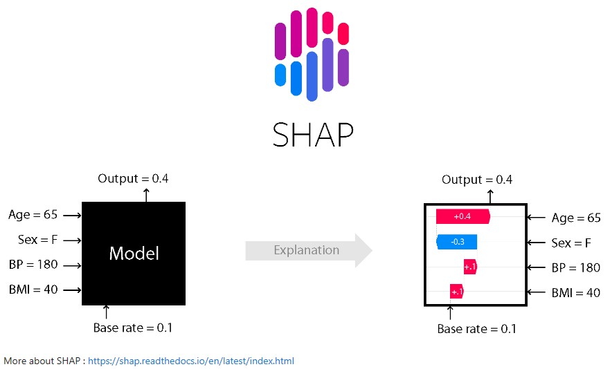
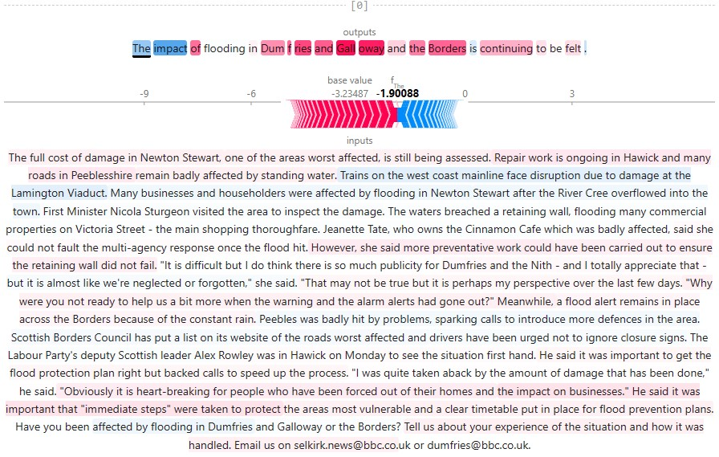
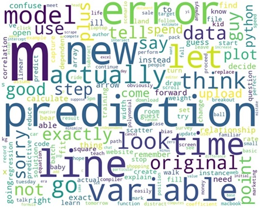

# text_summarization_using_transformers

An experimentation to compare different text summarization using transformer models.

There are 6 different summarization models that has been tested for this application, including transformer-based models pre-trained on large corpora. 

The datasets used for this application are the transcripts dataset acquired from online meeting platforms and the Extreme Summarization (XSum) dataset. 

  

 

The evaluation of these models is done using Rouge metrics (Rouge-1, Rouge-2, and Rouge-L) and selected the best-performing model as the final model. 

  

 

The application have built a bot that utilizes Telegram’s API and shares the generated summaries via group chat with the users.

  

 

### **Environment** 
Python 3+

### Run
    
Download all the dependencies.
    
    pip install -r requirements.txt

 

    Run the Jupyter Notebook

